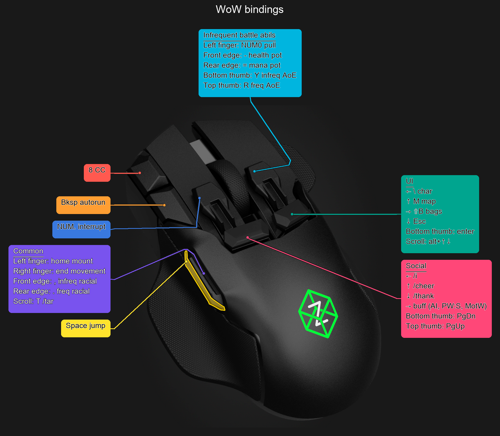

# Z3 Image Creator

Create annotated Swiftpoint Z3 binding reference images from readable JSON files.
The supplied mouse image is preserved at its original resolution. Colored cards sit
around it, with underlined optional headings and one binding per line. Pointers
route around the other mapped button surfaces, cards, and pointers. Margins grow
with the content; long text wraps instead of extending cards indefinitely.

This entire repo was vibe-coded to save myself time. I just wanted to be able to
modify my WoW hotkeys and update their reference image without spending a ton of
time on it.

## Example: my WoW shortcuts

This is the output generated from [WoW.json](WoW.json):



## Run

Requires Python 3.10 or newer.

```sh
python3 -m venv .venv
source .venv/bin/activate
python -m pip install -r requirements.txt
python render.py
```

On Windows activate with `.venv\Scripts\activate` instead.

The program scans **the directory containing `render.py`**, regardless of your
current working directory, for `.json` files (case-insensitive extension). It
processes them alphabetically and writes `output/<input-name>.png`, replacing
previous renders of the same name. Each processed or skipped filename is printed,
followed by a count. Invalid JSON, unrelated JSON, and invalid profiles are reported
and skipped; remaining files still run. Exit status is 1 if any file failed, 0
otherwise. A run with no JSON files reports zero files.

`WoW.json` contains all the bindings in the supplied reference, with “Right finger”
corrected. It uses the default unique button colors. Run the command above to generate `output/WoW.png`.

## Profile format

```json
{
  "title": "WoW bindings",
  "buttons": {
    "left_fingertip": {
      "background": "#ff594f",
      "bindings": ["NUM. interrupt"]
    },
    "right_trigger": {
      "title": "UI",
      "bindings": ["← \\ char", "↑ M map", "→ ⇧B bags", "↓ Esc"]
    }
  }
}
```

- The outer `title` is optional and appears above the image.
- `buttons` is a nonempty object. Omit any button you don't want to annotate.
- Each button's `title` is optional. If present and nonempty, it appears above its
  bindings and is underlined. An omitted title leaves no heading or blank line.
- `bindings` is a required array of nonempty strings, displayed in order. It may
  be empty if a nonempty title is supplied. Unicode arrows and explicit `\n`
  line breaks are supported. Escape a literal backslash as `\\` in JSON.
- `background` is an optional opaque `#RRGGBB` color. Each button otherwise uses
  its own stable color from a fixed distinct palette, independent of which
  buttons appear in the profile. Black or white text is selected using WCAG
  relative luminance for at least 4.5:1 contrast. A contrasting outline around
  the text and heading underline further separates them from the background.
- Unknown properties and button names are rejected to catch typos.

Supported button names:

| JSON name | Physical control |
| --- | --- |
| `left_click` | Main left click |
| `right_click` | Main right click |
| `scroll` | Scroll wheel / middle click |
| `front_edge` | Front left edge button |
| `rear_edge` | Rear left edge button |
| `left_fingertip` | Left fingertip cap |
| `right_fingertip` | Right fingertip cap |
| `left_trigger` | Left trigger paddle |
| `right_trigger` | Right trigger paddle |
| `top_thumb` | Upper thumb button |
| `bottom_thumb` | Lower thumb button, outlined yellow in the supplied base |

## Options and fonts

```sh
python render.py --input-dir ./profiles --output-dir ./renders
python render.py --font /path/to/UnicodeFont.ttf
python -m unittest discover -s tests -v
```

The renderer looks for Arial Unicode on macOS, DejaVu Sans on Linux, or Arial on
Windows. On Linux install your distribution's DejaVu font package if necessary.
Use `--font` for a different font, especially for scripts outside the default
font's glyph coverage. Fonts are not bundled.

## Layout and assets

`assets/z3-base.png` is the second user-supplied image, with its pixels preserved and metadata removed,
including its existing yellow thumb outline and green logo. Button polygons and
pointer anchors in `render.py` are calibrated to that particular image, using the
third supplied image for names. Replacing the base requires recalibrating those
coordinates. The [Swiftpoint quick-start guide](https://support.swiftpoint.com/portal/en/kb/articles/quick-start-guide)
also describes the fingertip and trigger caps.

Cards use top, left, and right regions and are packed without overlap. The mouse
is never stretched or cropped. Pointers use obstacle-aware routing with straight
segment simplification. Their small endpoint dots deliberately touch the named
button. Extremely crowded configurations can make routing impossible; those
profiles report a failure instead of drawing across protected controls. Large
amounts of text naturally require more canvas space.

Generated PNGs are ignored by Git except for `output/WoW.png`, which is tracked
as the README example. Running the renderer updates that example too. Virtual
environments and Python caches are also ignored.
The supplied photograph remains subject to its original rights; no license to
redistribute that photograph is asserted here.
